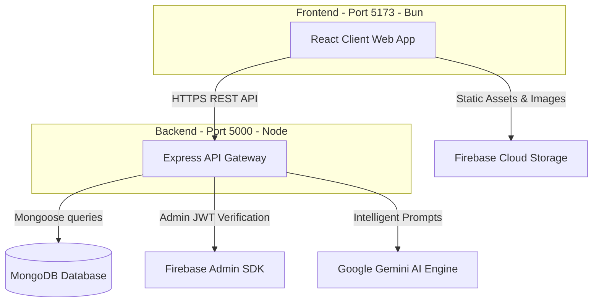

# 💼 ServiceMatch — Elite Hospitality Job Matching Platform

<p align="center">
  
  
  
  
  
  
  
  
</p>

ServiceMatch is a state-of-the-art, premium job matching platform designed specifically for the hospitality sector. It seamlessly connects high-end hospitality venues (hotels, bars, fine dining restaurants) with professional service providers (waiters, servers, bartenders). Powered by Google Gemini AI, it offers direct job suggestions, automated profile verification via OTP, real-time alerts, and a fully interactive, custom-designed dark glassmorphic interface.

---

## 🗺️ Table of Contents
1. [🌟 Key Features](#-key-features)
2. [💻 Tech Stack & Key Libraries](#-tech-stack--key-libraries)
3. [🏗️ System Architecture](#️-system-architecture)
4. [📂 Detailed Folder Structure](#-detailed-folder-structure)
5. [🔧 Environment Variables & Config](#-environment-variables--config)
6. [🚀 Quick Start & Installation](#-quick-start--installation)
7. [📡 API Endpoints Reference](#-api-endpoints-reference)
8. [🎨 Design System & Premium UX](#-design-system--premium-ux)
9. [🤝 Authors & Contributions](#-authors--contributions)

---

## 🌟 Key Features

### 🤵 For Service Providers (Waiters/Servers)
*   **Intuitive Job Discovery**: Filter listings dynamically using a curated list of all major Indian cities with live autocomplete matching.
*   **Comprehensive Profile Builder**: Show your professional experience, specialty skills (e.g., bartending, guest relations), speaking languages, and profile photos.
*   **Instant Application Tracking**: A real-time tracker showing details of all applied jobs, interview invitations, and active offers.
*   **Secure OTP Verification**: Verify your identity instantly via OTP-based mobile registration.

### 🏨 For Hotels & Employers
*   **Elite Profile Hub**: Design a premium brand card including description, layout images, amenities, and exact location markers.
*   **Job Deployment Suite**: Create high-fidelity job cards indicating shift type, daily rate ranges, dress code, specialized requirements, and spot openings.
*   **Talent Pipeline Management**: Evaluate applicants with a streamlined interface, view full waiter resumes, and update application status (Shortlisted, Interview, Hired, Rejected).

### 🤖 Smart AI Integrations
*   **Gemini AI Chatbot**: An embedded intelligent agent that helps candidates format their hospitality resumes, prepare for interview questions, and navigate the application platform.
*   **Firebase Integration**: Secure cloud storage for profile images and live real-time notification hubs.

---

## 💻 Tech Stack & Key Libraries

### Frontend (Client-Side)
*   **Core**: React 18, TypeScript 5.8, Vite (Fast Dev Server)
*   **Routing & Queries**: React Router DOM v6, TanStack React Query v5 (efficient caching)
*   **Styling**: Tailwind CSS v3, CSS Glassmorphism variables
*   **Animations**: `framer-motion` (staggered cards, fluid panel sliders), `lottie-react` (premium vector loops)
*   **Components**: Radix UI Primitives (Accordion, Dialog, Tabs, Dropdown-Menu, etc.), Shadcn UI pattern, Lucide React Icons
*   **Analytics**: Recharts (for beautiful dashboard analytics graphs)

### Backend (Server-Side)
*   **Environment**: Node.js, Express (ES Modules execution format)
*   **Database ORM**: Mongoose 8 (MongoDB Atlas)
*   **AI Integration**: `@google/generative-ai` (Gemini Pro API integration)
*   **Authentication**: JWT (JSON Web Tokens), BCrypt.js (password hashing)
*   **Identity Service**: Firebase Admin SDK (Cloud storage and secure auth support)

---

## 🏗️ System Architecture

The diagram below maps the clean, decoupled flow of data across the ServiceMatch architecture:



---

## 📂 Detailed Folder Structure

The repository is divided into a clean client-side workspace (`src`) and server-side package (`server`):

```
NewServiceMatch/
├── .env.local             # Client-side configuration (Firebase client secrets)
├── index.html             # Vite entry web template
├── package.json           # Frontend scripts & standard dependencies
├── tailwind.config.ts     # Deep design tokens and UI custom configuration
├── tsconfig.json          # TypeScript workspace settings
├── vite.config.ts         # Vite bundler, paths & build configs
│
├── src/                   # React Client Source Code
│   ├── assets/            # Global images, graphics, and visual design files
│   ├── components/        # Universal UI primitives (Shadcn UI blocks, dialogs, buttons)
│   ├── constants/         # Centralized data structures (e.g., standard Indian cities lists)
│   ├── hooks/             # Custom React Hooks (authentication tracking, local state hooks)
│   ├── layouts/           # Page structural grids, sidebars, and navigation shells
│   ├── lib/               # Shared libraries (Axios instances, class mergers `utils.ts`)
│   ├── pages/             # Authenticated entry pages (Login, Signup, OTP, Legal Disclaimers)
│   ├── services/          # Abstract class layers representing backend network gateways
│   ├── theme/             # Styling & layout palette overrides
│   ├── hotel/             # Hotel Portal Features
│   │   ├── Applicants/    # Candidate tracking, evaluation, and list sheets
│   │   ├── Dashboard/     # Employer metrics dashboard & operations overview
│   │   ├── Jobs/          # Job management forms & creation panels
│   │   ├── Notifications/ # Dedicated employer alerts & action notifications
│   │   ├── Profile/       # Hotel brand editing, descriptions & image galleries
│   │   └── layout/        # Layout grid for employer administration
│   │
│   ├── waiter/            # Waiter Portal Features
│   │   ├── AppliedJobs.tsx # Detailed table representing waiter's submitted applications
│   │   ├── Dashboard.tsx  # Dynamic performance graphs, quick actions, sidebar control
│   │   ├── FindJobs.tsx   # Live job feed with interactive search & city autocomplete
│   │   ├── Notifications.tsx # Inbox containing updates on applications, invites
│   │   └── Profile.tsx    # Live resume cards, skill badges, photo editor
│   │
│   ├── App.tsx            # Main frontend router, theme providers, & global state wrapper
│   └── main.tsx           # Client entry React DOM compiler
│
└── server/                # Node.js Express API Server Source
    ├── .env               # Server secrets (MongoDB Atlas connection string, Gemini Keys)
    ├── server.js          # Express app initializer, port routing & middleware stack
    ├── config/            # Database controllers & environment configs
    ├── controllers/       # Route action handlers (Logic mapping)
    │   ├── application.controller.js  # Handle apply, review, hire flows
    │   ├── auth.controller.js         # User registration, email verification, passwords
    │   ├── hotel.controller.js        # Brand modifications, dashboard analytics loader
    │   ├── job.controller.js          # CRUD operations for listings
    │   ├── userController.js          # Core profile updates, location validation
    │   └── waiter.controller.js       # Live search engine, skills allocation, resume updater
    │
    ├── middleware/        # Route interceptors (Authentication token filters)
    ├── models/            # Mongoose Schema Definitions
    │   ├── userModel.js   # Global Credentials, Role settings, & Base contact items
    │   ├── Job.js         # Rate parameters, shifting, requirements, description details
    │   ├── HotelProfile.js # Multi-photo listings, facilities checklist, geographic data
    │   └── Application.js # Connection matching candidate ID to Job ID with status states
    │
    ├── routes/            # HTTP Route Definitions (Express Routers)
    ├── scripts/           # Testing routines & database seed loaders
    ├── utils/             # Dedicated helpers (Firebase initializer, Gemini configuration)
    └── package.json       # Backend commands, node dependencies, module type definitions
```

---

## 🔧 Environment Variables & Config

To launch the project, you must set up environment files in both the client root folder and the backend server folder.

### 1. Client Environment (`/.env.local`)
Create a `.env.local` file in the **root** folder:
```env
VITE_FIREBASE_API_KEY=your_firebase_api_key
VITE_FIREBASE_AUTH_DOMAIN=your_project_id.firebaseapp.com
VITE_FIREBASE_PROJECT_ID=your_project_id
VITE_FIREBASE_STORAGE_BUCKET=your_project_id.appspot.com
VITE_FIREBASE_MESSAGING_SENDER_ID=your_messaging_sender_id
VITE_FIREBASE_APP_ID=your_firebase_app_id
```

### 2. Backend Environment (`/server/.env`)
Create a `.env` file in the `/server` folder:
```env
PORT=5000
MONGO_URI=mongodb+srv://<username>:<password>@cluster0.mongodb.net/ServiceMatch?retryWrites=true&w=majority
JWT_SECRET=your_jwt_signing_secret_phrase
GEMINI_API_KEY=your_google_ai_gemini_api_key
```

---

## 🚀 Quick Start & Installation

Ensure you have [Node.js](https://nodejs.org/) (v20+) or [Bun](https://bun.sh/) installed.

### Setup Step 1: Install Dependencies

#### Frontend (Root Directory)
```bash
# Using npm
npm install

# Or using Bun (highly recommended for performance)
bun install
```

#### Backend Server Directory
```bash
cd server

# Using npm
npm install

# Or using Bun
bun install
```

---

### Setup Step 2: Start Development Servers

To run the application locally, start both the frontend server and the backend API server.

#### Option A: Running with Bun (Fastest)
1.  **Start Frontend** (Run from root folder):
    ```bash
    bun run dev
    ```
    *The client app will launch at [http://localhost:5173](http://localhost:5173)*

2.  **Start Backend** (Run from `/server` folder):
    ```bash
    cd server
    bun run dev
    ```
    *The backend API will start at [http://localhost:5000](http://localhost:5000)*

---

#### Option B: Running with NPM
1.  **Start Frontend** (Run from root folder):
    ```bash
    npm run dev
    ```

2.  **Start Backend** (Run from `/server` folder):
    ```bash
    cd server
    npm run dev
    ```

---

## 📡 API Endpoints Reference

ServiceMatch uses a modern HTTP REST API designed with clean controller actions:

### 🔑 Authentication Routes (`/api/auth`)
*   `POST /api/auth/signup` - Register a brand new user (Waiter or Hotel Owner).
*   `POST /api/auth/login` - Authenticate local credentials and return access JWT tokens.
*   `POST /api/auth/otp/send` - Dispatches an identity verification code to mobile numbers.
*   `POST /api/auth/otp/verify` - Verifies custom security codes to unlock profiles.

### 💼 Job Board Routes (`/api/jobs`)
*   `GET /api/jobs` - Returns an active, searchable board of available hospitality shifts. Supports search parameters.
*   `POST /api/jobs` - (Hotel Auth required) Create an active job shift.
*   `GET /api/jobs/:id` - Return deep metadata information for a single job opening.
*   `PUT /api/jobs/:id` - Update description parameters for active vacancies.
*   `DELETE /api/jobs/:id` - Archive active postings.

### 📝 Applications Routes (`/api/applications`)
*   `POST /api/applications/apply` - (Waiter Auth required) Submit active digital resume for a vacancy.
*   `GET /api/applications/my-applications` - Fetch applicant's full history.
*   `GET /api/applications/jobs/:jobId` - (Hotel Auth required) Fetch all candidate sheets matching a job posting.
*   `PATCH /api/applications/:id/status` - (Hotel Auth required) Accept/Reject candidates, update evaluation levels.

### 🤖 AI Conversational Route (`/chat`)
*   `POST /chat` - Interactive communication with the Google Gemini Pro Agent. Provide historical prompts to get contextual resume tips or assistance.

---

## 🎨 Design System & Premium UX

ServiceMatch uses a bespoke premium design system built upon modern, accessible web principles:
*   **Vibrant Deep-Slate Base**: Tailored `#031525` dark background creating high contrast with glowing blue and teal accents.
*   **Fluid Glassmorphism**: Cards use border-blurs, glowing borders (`backdrop-filter: blur(16px)`), and semi-opaque panels for a cohesive SaaS look.
*   **Fluid Micro-Animations**: Built entirely with `framer-motion`. Tab changes, card entrances, and slideouts animate gracefully without performance lag.
*   **Custom Fonts**: Premium sans-serif fonts imported via Tailwind integration to ensure stunning text readability.

---

## 🤝 Authors & Contributions

Developed with ❤️ by **Satyam Singh** (@satyamsingh39).

This project is licensed under the MIT License - see the LICENSE file for details.
